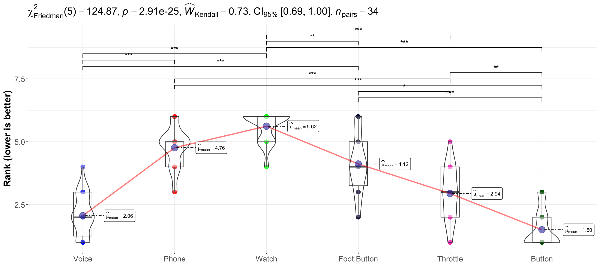
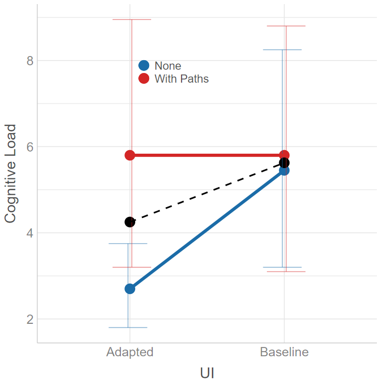
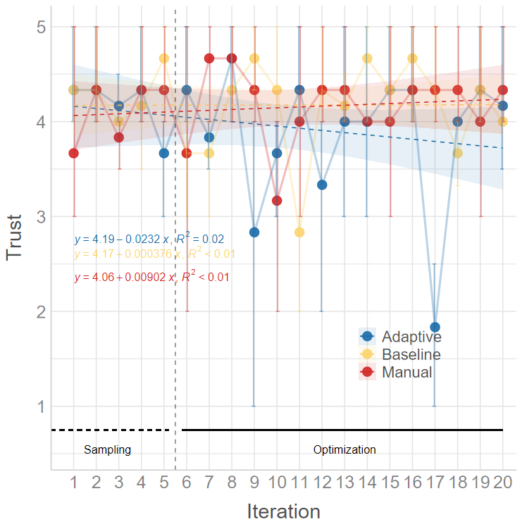

# rCode: Enhanced R Functions for Statistical Analysis and Reporting

> Created by [Mark Colley](https://m-colley.github.io/)

[](https://doi.org/10.5281/zenodo.16849778)

`rCode` is a collection of custom R functions that streamline statistical analysis and result reporting. Built upon popular R packages such as [ggstatsplot](https://github.com/IndrajeetPatil/ggstatsplot) and [ARTool](https://github.com/mjskay/ARTool), this collection offers a wide array of tools for simplifying reproducible analyses, generating high-quality visualizations, and producing APA-compliant outputs.

The primary goal of this package is to significantly reduce repetitive coding efforts, allowing you to focus on interpreting results. Whether you're dealing with ANOVA assumptions, reporting effect sizes, or creating publication-ready visualizations, `rCode` makes these tasks easier.

## Key Features
- **Automated Assumption Checking**: For ANOVA models, automatically verify normality and homogeneity of variance.
- **Enhanced ggstatsplot Functions**: Easily switch between parametric and non-parametric versions of tests based on the data's characteristics.
- **APA-Compliant Reporting**: Copy-paste ready results in LaTeX format, suitable for academic publications.
- **Custom Visualizations**: Generate effect plots and multi-objective optimization plots with minimal effort.
- **Pareto Analysis and Post-Hoc Tests**: Automate these analyses and produce formatted outputs.

## Installation

| Type        | Command                                                 |
|-------------|---------------------------------------------------------|                  
| Development | `devtools::source_url("https://raw.githubusercontent.com/M-Colley/rCode/main/r_functionality.R")` |

## Summary of Benefits 
- **Code Reduction**: Automates common tasks in data analysis, such as assumption checks and reporting.
- **Copy-Paste Ready Outputs**: Streamlines report generation with LaTeX-ready text outputs.
- **Flexible Visualizations**: Customize plots and output professional-quality graphics with ease.
- **Easy-to-Update**: Modifying analyses or text outputs is simple and consistent.

---

## Primary Functions


### `checkAssumptionsForAnova`
This function suite checks normality and homogeneity of variance assumptions for ANOVA models. Takes a vector of factors. For details on assumptions checking, refer to [Datanovia](https://www.datanovia.com/en/lessons/anova-in-r/#check-assumptions-1).

**Example:**
```r
checkAssumptionsForAnova(data = main_df, y = "dependent_var", factors = c("factor1", "factor2"))
```


### `ggwithinstatsWithPriorNormalityCheckAsterisk` and `ggbetweenstatsWithPriorNormalityCheckAsterisk`
These functions include APA-compliant asterisks (e.g., *** for p < 0.001) on your ggwithinstats or ggbetweenstats plots. They automatically adjust for the appropriate test based on the data's normality.

Note: Avoid using these functions if your data has more than two groups, as geom_signif does not support more than two groups.




### `generateEffectPlot`
Generates a plot that emphasizes either main effects or interaction effects, with clear formatting and options for publication-ready visuals. This function supports customizing group colors, axis labels, and plot size.

**Example:**

```r
generateEffectPlot(df = main_df, x = "factor1", y = "dependent_var", fillColourGroup = "group", ytext = "Y Label", xtext = "X Label", legendPos = c(0.1, 0.2), shownEffect = "interaction")
```




### `reportNPAV`
Generates APA-compliant LaTeX output for within-subject designs analyzed using np.anova. The function handles both main and interaction effects. The necessary LaTeX commands are:

```latex
\newcommand{\F}[3]{$F({#1},{#2})={#3}$}
\newcommand{\p}{\textit{p=}}
\newcommand{\pminor}{\textit{p$<$}}
```

**Example:**

```r
model <- np.anova(tlx_mental ~ factor1 * factor2 + Error(Subject / factor1), data = main_df)
reportNPAV(model, "Dependent Variable")
```

### `reportNPAVChi`

Similar to reportNPAV, but for between-subject designs. This function generates formatted LaTeX output for non-parametric ANOVA results. LaTeX commands:

```latex
\newcommand{\F}[3]{$F({#1},{#2})={#3}$}
\newcommand{\p}{\textit{p=}}
\newcommand{\pminor}{\textit{p$<$}}
```

### `reportNparLD`
Reports the model produced by nparLD in APA-compliant format. While still supported, this function has largely been superseded by np.anova for non-parametric variance analyses.

### `reportMeanAndSD`
For each level of an independent variable, this function calculates the mean and standard deviation of a dependent variable and returns them in APA-compliant LaTeX format:

```latex
\newcommand{\m}{\textit{M=}}
\newcommand{\sd}{\textit{SD=}}
```

**Example:**

```r
reportMeanAndSD(main_df, iv = "factor1", dv = "dependent_var")
```

### `reportDunnTest` and `reportDunnTestTable`
This function summarizes the results of FSA::dunnTest objects in text or table form. Both versions output LaTeX-ready results:

```latex
\newcommand{\padjminor}{\textit{p$_{adj}<$}}
\newcommand{\padj}{\textit{p$_{adj}$=}}
```

**Example:**

```r
d <- dunnTest(dependent_var ~ factor1, data = main_df, method = "holm")
reportDunnTest(main_df, d, iv = "factor1", dv = "dependent_var")
```

### `reportART`
Generates LaTeX-formatted results from art models for factorial designs. The necessary LaTeX commands are:

```latex
\newcommand{\F}[3]{$F({#1},{#2})={#3}$}
\newcommand{\p}{\textit{p=}}
\newcommand{\pminor}{\textit{p$<$}}
```


**Example:**

```r
model <- art(formula = dependent_var ~ factor1 * factor2 + Error(Subject / (factor1 * factor2)), data = main_df)
reportART(anova(model), "Dependent Variable")
```

### `add_pareto_emoa_column`
This function adds a Pareto front classification column to a dataset, useful in multi-objective optimization scenarios.

Attention: must be done per User - Conditon etc group.

**Example:**

```r
# This would do it over **all** participants and **all** conditions
objectives <- c("objective1", "objective2", "objective3")
main_df <- add_pareto_emoa_column(main_df, objectives)

# This would do it **per** participant and **per** condition combination
# (so far, does not natively support piping ``|>'')
main_df <- main_df |> 
  group_by(User_ID, ConditionID) |> 
  mutate(PARETO_EMOA = add_pareto_emoa_column(pick(everything()), objectives = objectives)$PARETO_EMOA) |> 
  ungroup()

```

### `generateMoboPlot`
Creates a multi-objective optimization plot, visualizing sampling and optimization phases. This is particularly useful for visualizing iterations in optimization problems.

**Example:**
```r
generateMoboPlot(df = main_df, x = "iteration", y = "objective1", fillColourGroup = "group", ytext = "Y Axis Label")
```

Example Plot:



### `remove_outliers_REI`
Calculates the Response Entropy Index (REI) and flags suspicious entries based on their REI percentile. This function is useful for identifying outliers in Likert scale data.

**Example:**

```r
result <- remove_outliers_REI(main_df, header = TRUE, variables = "var1,var2,var3", range = c(1, 5))
```


### `replace_values`
Replaces specified values in a data frame with custom replacements. This can be used to clean or preprocess your data.

**Example:**

```r
new_df <- replace_values(main_df, to_replace = c("bad_val1", "bad_val2"), replace_with = c("good_val1", "good_val2"))
```


### `checkAssumptionsForAnova_X_Factors` - DEPRECATED

This function suite checks normality and homogeneity of variance assumptions for ANOVA models. There are versions available for one, two, three, and four factors. For details on assumptions checking, refer to [Datanovia](https://www.datanovia.com/en/lessons/anova-in-r/#check-assumptions-1).

**Example:**
```r
checkAssumptionsForAnovaTwoFactors(data = main_df, y = "dependent_var", factor_1 = "factor1", factor_2 = "factor2")
```


*Contact*
For questions or remarks, please contact Mark Colley.


## Citations

```bibtex
@misc{colley2024rcode,
  author       = {Mark Colley},
  title        = {rCode: Enhanced R Functions for Statistical Analysis and Reporting},
  year         = {2024},
  howpublished = {\url{https://github.com/M-Colley/rCode}},
  note         = {A collection of custom R functions for streamlining statistical analysis, visualizations, and APA-compliant reporting.},
  doi          = {10.5281/zenodo.16849778},
  url          = {https://doi.org/10.5281/zenodo.16849778},
}
```


